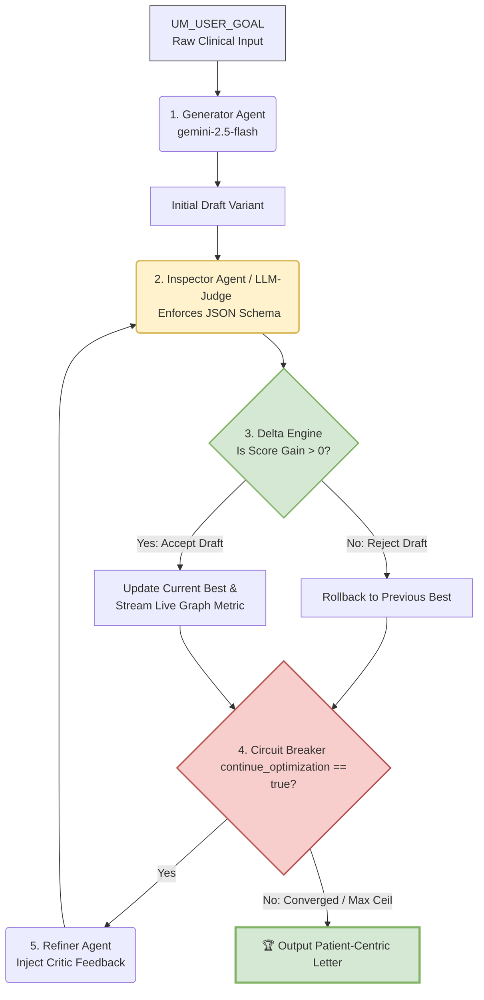

# 🤖 Agentic Reflection Pipeline with Live Observability

An engineering implementation of the **Reflection Design Pattern** built using the modern `google-genai` SDK and the `gemini-2.5-flash` model. This system automates the transition of dense, compliant Utilization Management (UM) healthcare denials into clear, patient-centric member communications through an objective, closed-loop evaluation state machine.

## 🌟 Key Engineering Highlights
* **Agentic State Machine**: Completely decouples text generation, programmatic validation, and corrective refinement into distinct specialized prompts.
* **Deterministic Quality Guardrails**: Features a calculation engine that automatically throws away candidate drafts showing negative or flat utility deltas, preserving the previous best text.
* **Cost-Aware Optimization**: Implements an LLM-as-a-Judge circuit breaker (`continue_optimization`) allowing the engine to dynamically stop executing upon hitting diminishing marginal returns.
* **Live Observability Canvas**: Merges `matplotlib` and `IPython.display` to stream real-time metric optimization charts directly inside the terminal screen.

## 🏗️ Architectural Topology & Feedback Loop

The system operates as an autonomous, closed-loop state machine. It isolates content drafting from programmatic inspection, ensuring that updates are only applied if they pass strict quality metrics:



---

## 📈 Optimization Mechanics & Trajectory

The orchestrator tracks a multi-dimensional utility index scoring criteria out of a maximum value of 15 points:
1. **Readability (1-5)**: Translation of complex clinical jargon down to an accessible 6th-8th grade reading level.
2. **Empathy (1-5)**: Delivering clarity while maintaining a warm, supportive, human tone.
3. **Compliance (1-5)**: Strict validation that mandatory legal facts (like the 60-day appeal timeline) are never erased during simplification.

```text
🚀 Baseline Draft Generated. Initial Score: 8/15
🔄 Iteration 1: Optimization in progress...
   ✅ Improvement detected! Score increased by +4 points.
🔄 Iteration 2: Optimization in progress...
   ✅ Improvement detected! Score increased by +3 points.
   🛑 LLM Judge determined further gains are minimal. Stopping loop.
🎯 Pipeline Completed. Final Best Score: 15/15
```

---

## 🛠️ Installation & Setup

1. **Clone the repository:**
   ```bash
   git clone https://github.com
   cd agentic-reflection-pipeline
   ```

2. **Install dependencies:**
   ```bash
   pip install google-genai matplotlib ipython
   ```

3. **Configure your API Credential:**
   Export your free-tier Google AI Studio credential as an environment variable to prevent security leaks:
   ```bash
   export GEMINI_API_KEY="your-api-key-here"
   ```

4. **Run the pipeline:**
   Execute the code within a Jupyter Notebook, Google Colab workspace, or terminal shell to watch the line chart stream upward in real time.


## 🗺️ Roadmap & Next Milestones

To evolve this single-file prototype into an enterprise-grade execution engine, the following architectural enhancements are planned:

### 1. Advanced Evaluation Metric: Embedding-Based Semantic Shift Tracking
* **Objective:** Replace heuristic metrics with high-dimensional distance math.
* **Mechanism:** Integrate `text-embedding-3-small` (or Gemini text embeddings) to vectorize the generated text at each iteration. Calculate the **Cosine Similarity** between the output vector and the gold-standard rubric vector. 
* **Value Add:** Provides a true mathematical proxy for conceptual drift and semantic alignment, visualizable as a secondary real-time line metric.

### 2. State Optimization: Dynamic Temperature & Dynamic Prompt Decay
* **Objective:** Break optimization plateaus when a refinement round gets rejected.
* **Mechanism:** Implement an adaptive feedback loop. If an iteration yields a flat or negative utility delta, the orchestrator automatically increments the model's `temperature` configuration (e.g., from 0.2 to 0.7) to encourage exploration, while injecting "negative constraints" compiled from the critic's history.
* **Value Add:** Prevents the agent from getting trapped in local minima or repeating identical phrasing failures.

### 3. Production Readiness: Asynchronous Orchestration & Tracing
* **Objective:** Eliminate blocking network latency and enable industrial observability.
* **Mechanism:** Refactor the loop using asynchronous execution primitives (`asyncio`) and hook the payload telemetry into a specialized LLM tracing framework like **LangSmith** or **Arize Phoenix**.
* **Value Add:** Introduces comprehensive step-by-step cost analysis, latency tracking, and structured dataset logging for regression testing.

### 4. Financial Guardrails: Per-Iteration Token Accounting & Cost/RU Tracking
* **Objective:** Instrument runtime financial monitoring to calculate and curb cumulative API execution overhead.
* **Mechanism:** Extract the `usage_metadata` object (specifically tracking `input_token_count` and `output_token_count`) from every model response. Convert these numbers into Resource Units (RUs) and real-time dollar amounts using provider-specific pricing structures, plotting a cumulative cost curve alongside the utility metric graph.
* **Value Add:** Prevents run-away financial loops by implementing an algorithmic safety ceiling (e.g., stopping the agent instantly if an execution chain exceeds $0.02 or a designated token limit), matching high-quality text output with strict cloud resource efficiency.
